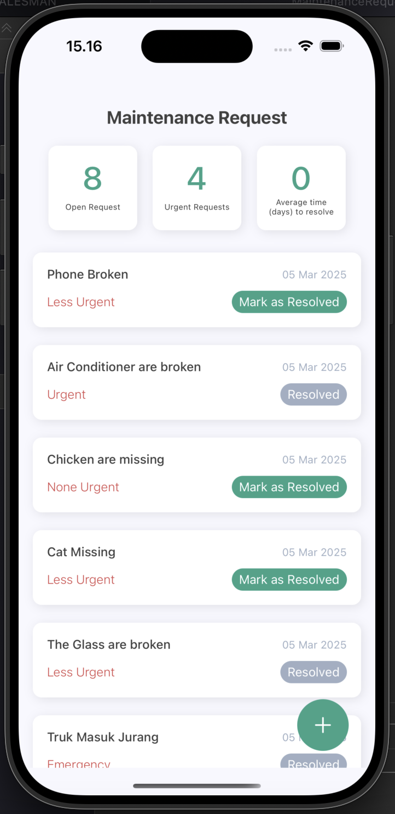
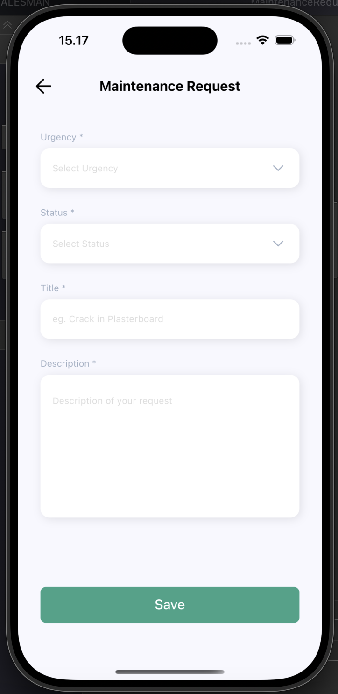
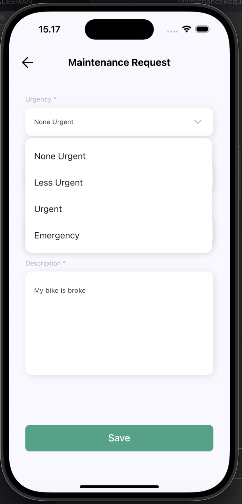

# Maintenance Request Application

This application is a maintaining request to resolve when user can create the request by urgency ex: none urgent, less urgent, urgent and emergency, also user can mark the status request to be resolved if the request is resolved.

## Table of Contents

- [Getting Started](#getting-started)
  - [Prerequisites](#prerequisites)
  - [Installation](#installation)
  - [Setup](#setup)
- [Screenshots](#screenshots)
- [Built With](#built-with)
- [Author](#author)

## Getting Started

Before starting to install the project, there're some things that need to be done first.

### Prerequisites

Make sure all of these are properly installed in your system.

| Application  | Download                                                                            |
| ------------ | ----------------------------------------------------------------------------------- |
| Git          | [Windows](https://gitforwindows.org/) / [Linux](https://git-scm.com/download/linux) / [MacOS](https://git-scm.com/download/mac) |
| React Native | [Link](https://facebook.github.io/react-native/docs/getting-started)                |

### Installation

First, clone this repository into your system.

```
git clone https://github.com/nurmuhamadrum/maintenance-request.git
```

Then, install all the packages that described in `package.json`.

```
npm install
```

if you're using iOS then pod install on ios folder directory

```
pod install
```

### Setup

For the client setup, if you are using physical device to run the app, make sure your ADB drivers already installed or you can use Android Emulator from AVD (Android Virtual Device) Manager of Android Studio (_This part should be done while installing the React Native framework_) on this development I use iOS for development.

Then, install and run the application.

And for IOS :

`npm run ios`

And for Android :

`npm run android`

Notes : Because I'm using Local server development you should run the server first before run the application and follow the instruction to run local server on link bellow.

```
https://github.com/nurmuhamadrum/maintenance-request-graphql
```

then after the server local is run on 'http://localhost:4000/graphql', then run the application and Wait till the application is installed and run into your device. Now, you can explore the Application and its features. Enjoy!

## Screenshots

<div style={{ display: 'flex' }}>

  
  
  
  

</div>


## Built With

- [REACT NATIVE](https://facebook.github.io/react-native/) - MOBILE FRONTEND
- [GRAPHQL](https://graphql.org/) - GRAPHQL
- [NODEJS](https://nodejs.org/en) - NODEJS

## Author

**Nur Muhamad Rum** - (https://nurmuhamadrum.vercel.app/)
